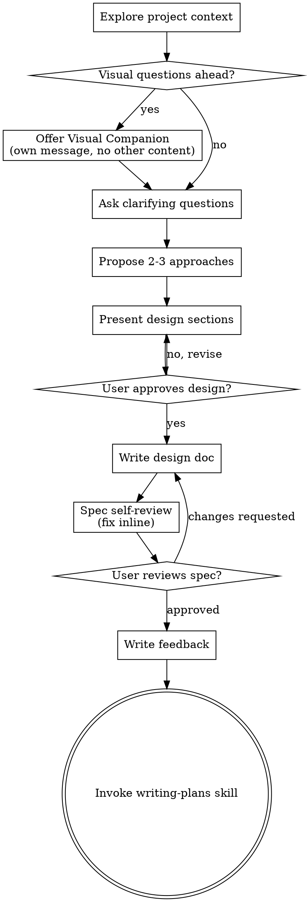

## Task 4: Create brainstorming skill override

**Files:**
- Create: `~/.claude/skills/brainstorming/SKILL.md`

This overrides the Superpowers brainstorming skill (at `~/.claude/plugins/cache/claude-plugins-official/superpowers/5.0.7/skills/brainstorming/SKILL.md`) to add a feedback write step after the user approves the design (Step 8 in the original skill).

The override prepends a frontmatter noting it's an override, and adds a "After user approval" step.

- [ ] **Step 1: Create brainstorming override**

```markdown
---
name: brainstorming
description: "You MUST use this before any creative work - creating features, building components, adding functionality, or modifying behavior. Explores user intent, requirements and design before implementation. Override of superpowers:brainstorming with feedback step."
---

# Brainstorming Ideas Into Designs

**Override note:** This skill extends the Superpowers brainstorming skill with a feedback-writing step after design approval. The base skill content is preserved below.

---

## Feedback Step (added by override)

After the user approves the design (after Step 8: "User reviews spec?" with approved), before transitioning to writing-plans:

### Write brainstorming feedback

Write a feedback file to `~/.claude/memory/feedback/brainstorming-$(date +%Y-%m-%d).md`:

```bash
FEEDBACK_FILE=~/.claude/memory/feedback/brainstorming-$(date +%Y-%m-%d).md
cat > "$FEEDBACK_FILE" << 'FEEDBACK_EOF'
---
name: brainstorming-feedback-$(date +%Y-%m-%d)
type: feedback
---

## Brainstorming Feedback

**Session:** $(pwd | xargs basename)
**Date:** $(date +%Y-%m-%d)
**Outcome:** approved

### What worked
- <brief note on what went well in this brainstorming session>

### What didn't work
- <brief note on what was unclear or took too long>

### Next time try
- <suggestion for how to improve the next brainstorming session>

### Energy level (1-5)
<1-5 rating>
FEEDBACK_EOF
```

Then announce: "Feedback written. Transitioning to writing-plans."

---

## Original Brainstorming Skill (preserved)

Help turn ideas into fully formed designs and specs through natural collaborative dialogue.

Start by understanding the current project context, then ask questions one at a time to refine the idea. Once you understand what you're building, present the design and get user approval.

<HARD-GATE>
Do NOT invoke any implementation skill, write any code, scaffold any project, or take any implementation action until you have presented a design and the user has approved it. This applies to EVERY project regardless of perceived simplicity.
</HARD-GATE>

## Anti-Pattern: "This Is Too Simple To Need A Design"

Every project goes through this process. A todo list, a single-function utility, a config change — all of them. "Simple" projects are where unexamined assumptions cause the most wasted work. The design can be short (a few sentences for truly simple projects), but you MUST present it and get approval.

## Checklist

You MUST create a task for each of these items and complete them in order:

1. **Explore project context** — check files, docs, recent commits
2. **Offer visual companion** (if topic will involve visual questions) — this is its own message, not combined with a clarifying question. See the Visual Companion section below.
3. **Ask clarifying questions** — one at a time, understand purpose/constraints/success criteria
4. **Propose 2-3 approaches** — with trade-offs and your recommendation
5. **Present design** — in sections scaled to their complexity, get user approval after each section
6. **Write design doc** — save to `docs/superpowers/specs/YYYY-MM-DD-<topic>-design.md` and commit
7. **Spec self-review** — quick inline check for placeholders, contradictions, ambiguity, scope (see below)
8. **User reviews written spec** — ask user to review the spec file before proceeding
9. **Transition to implementation** — invoke writing-plans skill to create implementation plan

## Process Flow



**The terminal state is writing feedback, then invoking writing-plans.** Do NOT invoke any other implementation skill. The ONLY skill you invoke after brainstorming is writing-plans.

## The Process

**Understanding the idea:**

- Check out the current project state first (files, docs, recent commits)
- Before asking detailed questions, assess scope: if the request describes multiple independent subsystems (e.g., "build a platform with chat, file storage, billing, and analytics"), flag this immediately. Don't spend questions refining details of a project that needs to be decomposed first.
- If the project is too large for a single spec, help the user decompose into sub-projects: what are the independent pieces, how do they relate, what order should they be built? Then brainstorm the first sub-project through the normal design flow. Each sub-project gets its own spec → plan → implementation cycle.
- For appropriately-scoped projects, ask questions one at a time to refine the idea
- Prefer multiple choice questions when possible, but open-ended is fine too
- Only one question per message - if a topic needs more exploration, break it into multiple questions
- Focus on understanding: purpose, constraints, success criteria

**Exploring approaches:**

- Propose 2-3 different approaches with trade-offs
- Present options conversationally with your recommendation and reasoning
- Lead with your recommended option and explain why

**Presenting the design:**

- Once you believe you understand what you're building, present the design
- Scale each section to its complexity: a few sentences if straightforward, up to 200-300 words if nuanced
- Ask after each section whether it looks right so far
- Cover: architecture, components, data flow, error handling, testing
- Be ready to go back and clarify if something doesn't make sense

**Design for isolation and clarity:**

- Break the system into smaller units that each have one clear purpose, communicate through well-defined interfaces, and can be understood and tested independently
- For each unit, you should be able to answer: what does it do, how do you use it, and what does it depend on?
- Can someone understand what a unit does without reading its internals? Can you change the internals without breaking consumers? If not, the boundaries need work.
- Smaller, well-bounded units are also easier for you to work with - you reason better about code you can hold in context at once, and your edits are more reliable when files are focused. When a file grows large, that's often a signal that it's doing too much.

**Working in existing codebases:**

- Explore the current structure before proposing changes. Follow existing patterns.
- Where existing code has problems that affect the work (e.g., a file that's grown too large, unclear boundaries, tangled responsibilities), include targeted improvements as part of the design - the way a good developer improves code they're working in.
- Don't propose unrelated refactoring. Stay focused on what serves the current goal.

## After the Design

**Documentation:**

- Write the validated design (spec) to `docs/superpowers/specs/YYYY-MM-DD-<topic>-design.md`
  - (User preferences for spec location override this default)
- Use elements-of-style:writing-clearly-and-concisely skill if available
- Commit the design document to git

**Spec Self-Review:**
After writing the spec document, look at it with fresh eyes:

1. **Placeholder scan:** Any "TBD", "TODO", incomplete sections, or vague requirements? Fix them.
2. **Internal consistency:** Do any sections contradict each other? Does the architecture match the feature descriptions?
3. **Scope check:** Is this focused enough for a single implementation plan, or does it need decomposition?
4. **Ambiguity check:** Could any requirement be interpreted two different ways? If so, pick one and make it explicit.

Fix any issues inline. No need to re-review — just fix and move on.

### Module Design Block Requirement

Every significant module in a spec MUST have a Module Design Block:

```markdown
### Module: <Name>
- **Responsibility:** <One sentence — what it does>
- **Interface:** <Inputs, outputs — what it communicates with>
- **Dependencies:** <What it depends on, if anything>
- **Size target:** <200 lines max, single responsibility — if it needs more, decompose>
```

**Enforcement:** A spec is NOT approved until all modules have this block filled out. Vague or oversized modules are sent back for clarification before proceeding.

**User Review Gate:**
After the spec review loop passes, ask the user to review the written spec before proceeding:

> "Spec written and committed to `<path>`. Please review it and let me know if you want to make any changes before we start writing out the implementation plan."

Wait for the user's response. If they request changes, make them and re-run the spec review loop. Only proceed once the user approves.

**Implementation:**

- Write feedback (see Feedback Step above)
- Invoke the writing-plans skill to create a detailed implementation plan
- Do NOT invoke any other skill. writing-plans is the next step.

## Key Principles

- **One question at a time** - Don't overwhelm with multiple questions
- **Multiple choice preferred** - Easier to answer than open-ended when possible
- **YAGNI ruthlessly** - Remove unnecessary features from all designs
- **Explore alternatives** - Always propose 2-3 approaches before settling
- **Incremental validation** - Present design, get approval before moving on
- **Be flexible** - Go back and clarify when something doesn't make sense

## Visual Companion

A browser-based companion for showing mockups, diagrams, and visual options during brainstorming. Available as a tool — not a mode. Accepting the companion means it's available for questions that benefit from visual treatment; it does NOT mean every question goes through the browser.

**Offering the companion:** When you anticipate that upcoming questions will involve visual content (mockups, layouts, diagrams), offer it once for consent:
> "Some of what we're working on might be easier to explain if I can show it to you in a web browser. I can put together mockups, diagrams, comparisons, and other visuals as we go. This feature is still new and can be token-intensive. Want to try it? (Requires opening a local URL)"

**This offer MUST be its own message.** Do not combine it with clarifying questions, context summaries, or any other content. The message should contain ONLY the offer above and nothing else. Wait for the user's response before continuing. If they decline, proceed with text-only brainstorming.

**Per-question decision:** Even after the user accepts, decide FOR EACH QUESTION whether to use the browser or the terminal. The test: **would the user understand this better by seeing it than reading it?**

- **Use the browser** for content that IS visual — mockups, wireframes, layout comparisons, architecture diagrams, side-by-side visual designs
- **Use the terminal** for content that is text — requirements questions, conceptual choices, tradeoff lists, A/B/C/D text options, scope decisions

A question about a UI topic is not automatically a visual question. "What does personality mean in this context?" is a conceptual question — use the terminal. "Which wizard layout works better?" is a visual question — use the browser.

If they agree to the companion, read the detailed guide before proceeding:
`skills/brainstorming/visual-companion.md`

---

## Task 5: Create writing-plans skill override

**Files:**
- Create: `~/.claude/skills/writing-plans/SKILL.md`

This overrides the Superpowers writing-plans skill to add a feedback step after the plan is saved and before returning to the user.

- [ ] **Step 1: Create writing-plans override**

```markdown
---
name: writing-plans
description: Use when you have a spec or requirements for a multi-step task, before touching code. Override of superpowers:writing-plans with feedback step.
---

# Writing Plans

**Override note:** This skill extends the Superpowers writing-plans skill with a feedback-writing step after plan completion.

---

## Feedback Step (added by override)

After writing the plan to disk and completing the self-review, before the "Execution Handoff" section:

### Write writing-plans feedback

```bash
FEEDBACK_FILE=~/.claude/memory/feedback/writing-plans-$(date +%Y-%m-%d).md
cat > "$FEEDBACK_FILE" << 'FEEDBACK_EOF'
---
name: writing-plans-feedback-$(date +%Y-%m-%d)
type: feedback
---

## WritingPlans Feedback

**Session:** $(pwd | xargs basename)
**Date:** $(date +%Y-%m-%d)
**Outcome:** completed

### What worked
- <note on plan quality, clarity, completeness>

### What didn't work
- <note on gaps, ambiguity, or missing context>

### Next time try
- <suggestion for improving plan writing>

### Energy level (1-5)
<1-5 rating>
FEEDBACK_EOF
```

---

## Original writing-plans Skill (preserved)

## Overview

Write comprehensive implementation plans assuming the engineer has zero context for our codebase and questionable taste. Document everything they need to know: which files to touch for each task, code, testing, docs they might need to check, how to test it. Give them the whole plan as bite-sized tasks. DRY. YAGNI. TDD. Frequent commits.

Assume they are a skilled developer, but know almost nothing about our toolset or problem domain. Assume they don't know good test design very well.

**Announce at start:** "I'm using the writing-plans skill to create the implementation plan."

**Context:** This should be run in a dedicated worktree (created by brainstorming skill).

**Save plans to:** `docs/superpowers/plans/YYYY-MM-DD-<feature-name>.md`
- (User preferences for plan location override this default)

## Scope Check

If the spec covers multiple independent subsystems, it should have been broken into sub-project specs during brainstorming. If it wasn't, suggest breaking this into separate plans — one per subsystem. Each plan should produce working, testable software on its own.

## File Structure

Before defining tasks, map out which files will be created or modified and what each one is responsible for. This is where decomposition decisions get locked in.

- Design units with clear boundaries and well-defined interfaces. Each file should have one clear responsibility.
- You reason best about code you can hold in context at once, and your edits are more reliable when files are focused. Prefer smaller, focused files over large ones that do too much.
- Files that change together should live together. Split by responsibility, not by technical layer.
- In existing codebases, follow established patterns. If the codebase uses large files, don't unilaterally restructure - but if a file you're modifying has grown unwieldy, including a split in the plan is reasonable.

This structure informs the task decomposition. Each task should produce self-contained changes that make sense independently.

## Bite-Sized Task Granularity

**Each step is one action (2-5 minutes):**
- "Write the failing test" - step
- "Run it to make sure it fails" - step
- "Write minimal implementation to make the test pass" - step
- "Run the tests and make sure they pass" - step
- "Commit" - step

## Plan Document Header

**Every plan MUST start with this header:**

```markdown
# [Feature Name] Implementation Plan

> **For agentic workers:** REQUIRED SUB-SKILL: Use superpowers:subagent-driven-development (recommended) or superpowers:executing-plans to implement this plan task-by-task. Steps use checkbox (`- [ ]`) syntax for tracking.

**Goal:** [One sentence describing what this builds]

**Architecture:** [2-3 sentences about approach]

**Tech Stack:** [Key technologies/libraries]

---
```

## Task Structure

```markdown
### Task N: [Component Name]

**Files:**
- Create: `exact/path/to/file.py`
- Modify: `exact/path/to/existing.py:123-145`
- Test: `tests/exact/path/to/test.py`

- [ ] **Step 1: Write the failing test**

def test_specific_behavior():
    result = function(input)
    assert result == expected

- [ ] **Step 2: Run test to verify it fails**

Run: `pytest tests/path/test.py::test_name -v`
Expected: FAIL with "function not defined"

- [ ] **Step 3: Write minimal implementation**

def function(input):
    return expected

- [ ] **Step 4: Run test to verify it passes**

Run: `pytest tests/path/test.py::test_name -v`
Expected: PASS

- [ ] **Step 5: Commit**

git add tests/path/test.py src/path/file.py
git commit -m "feat: add specific feature"
```

## No Placeholders

Every step must contain the actual content an engineer needs. These are **plan failures** — never write them:
- "TBD", "TODO", "implement later", "fill in details"
- "Add appropriate error handling" / "add validation" / "handle edge cases"
- "Write tests for the above" (without actual test code)
- "Similar to Task N" (repeat the code — the engineer may be reading tasks out of order)
- Steps that describe what to do without showing how (code blocks required for code steps)
- References to types, functions, or methods not defined in any task

## Remember
- Exact file paths always
- Complete code in every step — if a step changes code, show the code
- Exact commands with expected output
- DRY, YAGNI, TDD, frequent commits

## Self-Review

After writing the complete plan, look at the spec with fresh eyes and check the plan against it. This is a checklist you run yourself — not a subagent dispatch.

**1. Spec coverage:** Skim each section/requirement in the spec. Can you point to a task that implements it? List any gaps.

**2. Placeholder scan:** Search your plan for red flags — any of the patterns from the "No Placeholders" section above. Fix them.

**3. Type consistency:** Do the types, method signatures, and property names you used in later tasks match what you defined in earlier tasks? A function called `clearLayers()` in Task 3 but `clearFullLayers()` in Task 7 is a bug.

If you find issues, fix them inline. No need to re-review — just fix and move on. If you find a spec requirement with no task, add the task.

## Execution Handoff

After saving the plan, write feedback (see Feedback Step above), then offer execution choice:

**"Plan complete and saved to `docs/superpowers/plans/<filename>.md`. Two execution options:**

**1. Subagent-Driven (recommended)** - I dispatch a fresh subagent per task, review between tasks, fast iteration

**2. Inline Execution** - Execute tasks in this session using executing-plans, batch execution with checkpoints

**Which approach?**

**If Subagent-Driven chosen:**
- **REQUIRED SUB-SKILL:** Use superpowers:subagent-driven-development
- Fresh subagent per task + two-stage review

**If Inline Execution chosen:**
- **REQUIRED SUB-SKILL:** Use superpowers:executing-plans
- Batch execution with checkpoints for review

---

## Task 6: Create verification-before-completion skill override

**Files:**
- Create: `~/.claude/skills/verification-before-completion/SKILL.md`

This overrides the Superpowers verification-before-completion skill to add a feedback step after verification passes.

- [ ] **Step 1: Create verification-before-completion override**

```markdown
---
name: verification-before-completion
description: Use when about to claim work is complete, fixed, or passing, before committing or creating PRs. Override of superpowers:verification-before-completion with feedback step.
---

# Verification Before Completion

**Override note:** This skill extends the Superpowers verification-before-completion skill with a feedback-writing step after verification passes.

---

## Feedback Step (added by override)

After verification passes and before claiming completion:

### Write verification feedback

```bash
FEEDBACK_FILE=~/.claude/memory/feedback/verification-$(date +%Y-%m-%d).md
cat > "$FEEDBACK_FILE" << 'FEEDBACK_EOF'
---
name: verification-feedback-$(date +%Y-%m-%d)
type: feedback
---

## Verification Feedback

**Session:** $(pwd | xargs basename)
**Date:** $(date +%Y-%m-%d)
**Outcome:** passed

### What worked
- <note on what verification approach worked well>

### What didn't work
- <note on what was flaky or unclear>

### Next time try
- <suggestion for improving verification>

### Energy level (1-5)
<1-5 rating>
FEEDBACK_EOF
```

---

## Original verification-before-completion Skill (preserved)

## Overview

Claiming work is complete without verification is dishonesty, not efficiency.

**Core principle:** Evidence before claims, always.

**Violating the letter of this rule is violating the spirit of this rule.**

## The Iron Law

NO COMPLETION CLAIMS WITHOUT FRESH VERIFICATION EVIDENCE

If you haven't run the verification command in this message, you cannot claim it passes.

## The Gate Function

BEFORE claiming any status or expressing satisfaction:

1. IDENTIFY: What command proves this claim?
2. RUN: Execute the FULL command (fresh, complete)
3. READ: Full output, check exit code, count failures
4. VERIFY: Does output confirm the claim?
   - If NO: State actual status with evidence
   - If YES: State claim WITH evidence
5. ONLY THEN: Make the claim

Skip any step = lying, not verifying

## Refactoring Gate (Anti-Bloat)

After tests pass, run the refactoring gate BEFORE claiming completion.

**Thresholds:**

| Check | Threshold | Action |
|-------|-----------|--------|
| Module size | > 300 lines | Flag for mandatory split |
| Function complexity | > 3 responsibilities | Flag for refactor |
| DRY — same file | Repeated logic | Auto-fix |
| DRY — same module dir | Repeated logic | Auto-fix |
| DRY — cross-module/domain | Repeated logic | Flag for review only |
| Dead code | Imported but unused | Auto-remove |

**DRY Auto-fix scope rules:**
- **Same file** → auto-extract, inline, deduplicate
- **Same module directory** → auto-extract, inline, deduplicate
- **Different module/domain** → flag with location report, never auto-fix

**Behavior when issues found:**
1. Auto-fix if the fix is mechanical (extract method, remove dead import, inline simple duplication)
2. Flag for review if judgment required (cross-domain duplication, large module split)
3. **Completion blocked** until all flagged issues resolved

## Common Failures

| Claim | Requires | Not Sufficient |
|-------|----------|----------------|
| Tests pass | Test command output: 0 failures | Previous run, "should pass" |
| Linter clean | Linter output: 0 errors | Partial check, extrapolation |
| Build succeeds | Build command: exit 0 | Linter passing, logs look good |
| Bug fixed | Test original symptom: passes | Code changed, assumed fixed |
| Regression test works | Red-green cycle verified | Test passes once |
| Agent completed | VCS diff shows changes | Agent reports "success" |
| Requirements met | Line-by-line checklist | Tests passing |

## Red Flags - STOP

- Using "should", "probably", "seems to"
- Expressing satisfaction before verification ("Great!", "Perfect!", "Done!", etc.)
- About to commit/push/PR without verification
- Trusting agent success reports
- Relying on partial verification
- Thinking "just this once"
- Tired and wanting work over
- **ANY wording implying success without having run verification**

## Rationalization Prevention

| Excuse | Reality |
|--------|---------|
| "Should work now" | RUN the verification |
| "I'm confident" | Confidence ≠ evidence |
| "Just this once" | No exceptions |
| "Linter passed" | Linter ≠ compiler |
| "Agent said success" | Verify independently |
| "I'm tired" | Exhaustion ≠ excuse |
| "Partial check is enough" | Partial proves nothing |
| "Different words so rule doesn't apply" | Spirit over letter |

## Key Patterns

**Tests:**
✅ [Run test command] [See: 34/34 pass] "All tests pass"
❌ "Should pass now" / "Looks correct"

**Regression tests (TDD Red-Green):**
✅ Write → Run (pass) → Revert fix → Run (MUST FAIL) → Restore → Run (pass)
❌ "I've written a regression test" (without red-green verification)

**Build:**
✅ [Run build] [See: exit 0] "Build passes"
❌ "Linter passed" (linter doesn't check compilation)

**Requirements:**
✅ Re-read plan → Create checklist → Verify each → Report gaps or completion
❌ "Tests pass, phase complete"

**Agent delegation:**
✅ Agent reports success → Check VCS diff → Verify changes → Report actual state
❌ Trust agent report

## Why This Matters

From 24 failure memories:
- your human partner said "I don't believe you" - trust broken
- Undefined functions shipped - would crash
- Missing requirements shipped - incomplete features
- Time wasted on false completion → redirect → rework
- Violates: "Honesty is a core value. If you lie, you'll be replaced."

## When To Apply

**ALWAYS before:**
- ANY variation of success/completion claims
- ANY expression of satisfaction
- ANY positive statement about work state
- Committing, PR creation, task completion
- Moving to next task
- Delegating to agents

**Rule applies to:**
- Exact phrases
- Paraphrases and synonyms
- Implications of success
- ANY communication suggesting completion/correctness

## The Bottom Line

**No shortcuts for verification.**

Run the command. Read the output. THEN claim the result.

This is non-negotiable.

---

## Task 7: Create finishing-a-development-branch skill override

**Files:**
- Create: `~/.claude/skills/finishing-a-development-branch/SKILL.md`

This overrides the Superpowers finishing-a-development-branch skill to add a feedback step after the merge/PR/abandon choice is executed.

- [ ] **Step 1: Create finishing-a-development-branch override**

```markdown
---
name: finishing-a-development-branch
description: Use when implementation is complete, all tests pass, and you need to decide how to integrate the work. Override of superpowers:finishing-a-development-branch with feedback step.
---

# Finishing a Development Branch

**Override note:** This skill extends the Superpowers finishing-a-development-branch skill with a feedback-writing step after merge/PR/abandon.

---

## Feedback Step (added by override)

After executing the chosen option (merge, PR, keep, or discard):

### Write finishing feedback

```bash
FEEDBACK_FILE=~/.claude/memory/feedback/finishing-$(date +%Y-%m-%d).md
cat > "$FEEDBACK_FILE" << 'FEEDBACK_EOF'
---
name: finishing-feedback-$(date +%Y-%m-%d)
type: feedback
---

## Finishing Feedback

**Session:** $(pwd | xargs basename)
**Date:** $(date +%Y-%m-%d)
**Outcome:** <merged|pr|kept|discarded>

### What worked
- <note on what went smoothly during finishing>

### What didn't work
- <note on issues encountered>

### Next time try
- <suggestion for improving the finishing process>

### Energy level (1-5)
<1-5 rating>
FEEDBACK_EOF
```

---

## Original finishing-a-development-branch Skill (preserved)

## Overview

Guide completion of development work by presenting clear options and handling chosen workflow.

**Core principle:** Verify tests → Present options → Execute choice → Clean up.

**Announce at start:** "I'm using the finishing-a-development-branch skill to complete this work."

## The Process

### Step 1: Verify Tests

**Before presenting options, verify tests pass:**

```bash
# Run project's test suite
npm test / cargo test / pytest / go test ./...
```

**If tests fail:**
Tests failing (<N> failures). Must fix before completing:

[Show failures]

Cannot proceed with merge/PR until tests pass.

Stop. Don't proceed to Step 2.

**If tests pass:** Continue to Step 2.

### Step 2: Refactoring Gate (Anti-Bloat)

**After tests pass, run refactoring gate BEFORE presenting merge options:**

Run a scan of all changed files since the feature branch split:

- **Module size (>300 lines):** List files exceeding hard limit
- **Function complexity (>3 responsibilities):** Flag complex functions
- **DRY same-file/dir:** Auto-fix repeated logic
- **DRY cross-module:** Flag locations for review
- **Dead imports:** Auto-remove

**Report format:**
Refactoring Gate Results:
- [Auto-fixed] N same-file DRY violations
- [Auto-fixed] N dead import removals
- [Flagged] N module size issues — review before merge
- [Flagged] N cross-module duplications — review before merge

**If any flagged issues:** Present them to user for review decision before proceeding.

**If all clear or user approves flagged issues:** Continue to Step 3.

### Step 3: Determine Base Branch

```bash
# Try common base branches
git merge-base HEAD main 2>/dev/null || git merge-base HEAD master 2>/dev/null
```

Or ask: "This branch split from main - is that correct?"

### Step 4: Present Options

Present exactly these 4 options:

Implementation complete. What would you like to do?

1. Merge back to <base-branch> locally
2. Push and create a Pull Request
3. Keep the branch as-is (I'll handle it later)
4. Discard this work

Which option?

**Don't add explanation** - keep options concise.

### Step 5: Execute Choice

#### Option 1: Merge Locally

```bash
# Switch to base branch
git checkout <base-branch>

# Pull latest
git pull

# Merge feature branch
git merge <feature-branch>

# Verify tests on merged result
<test command>

# If tests pass
git branch -d <feature-branch>
```

Then: Cleanup worktree (Step 6)

#### Option 2: Push and Create PR

```bash
# Push branch
git push -u origin <feature-branch>

# Create PR
gh pr create --title "<title>" --body "## Summary
<2-3 bullets of what changed>

## Test Plan
- [ ] <verification steps>"
```

Then: Cleanup worktree (Step 6)

#### Option 3: Keep As-Is

Report: "Keeping branch <name>. Worktree preserved at <path>."

**Don't cleanup worktree.**

#### Option 4: Discard

**Confirm first:**

This will permanently delete:
- Branch <name>
- All commits: <commit-list>
- Worktree at <path>

Type 'discard' to confirm.

Wait for exact confirmation.

If confirmed:
```bash
git checkout <base-branch>
git branch -D <feature-branch>
```

Then: Cleanup worktree (Step 6)

### Step 6: Cleanup Worktree

**For Options 1, 2, 4:**

Check if in worktree:
```bash
git worktree list | grep $(git branch --show-current)
```

If yes:
```bash
git worktree remove <worktree-path>
```

**For Option 3:** Keep worktree.

### Step 7: Write feedback

See Feedback Step above.

## Quick Reference

| Option | Merge | Push | Keep Worktree | Cleanup Branch |
|--------|-------|------|---------------|----------------|
| 1. Merge locally | ✓ | - | - | ✓ |
| 2. Create PR | - | ✓ | ✓ | - |
| 3. Keep as-is | - | - | ✓ | - |
| 4. Discard | - | - | - | ✓ (force) |

## Common Mistakes

**Skipping test verification**
- **Problem:** Merge broken code, create failing PR
- **Fix:** Always verify tests before offering options

**Open-ended questions**
- **Problem:** "What should I do next?" → ambiguous
- **Fix:** Present exactly 4 structured options

**Automatic worktree cleanup**
- **Problem:** Remove worktree when might need it (Option 2, 3)
- **Fix:** Only cleanup for Options 1 and 4

**No confirmation for discard**
- **Problem:** Accidentally delete work
- **Fix:** Require typed "discard" confirmation

## Red Flags

**Never:**
- Proceed with failing tests
- Merge without verifying tests on result
- Delete work without confirmation
- Force-push without explicit request

**Always:**
- Verify tests before offering options
- Present exactly 4 options
- Get typed confirmation for Option 4
- Clean up worktree for Options 1 & 4 only

## Integration

**Called by:**
- **subagent-driven-development** (Step 7) - After all tasks complete
- **executing-plans** (Step 5) - After all batches complete

**Pairs with:**
- **using-git-worktrees** - Cleans up worktree created by that skill
